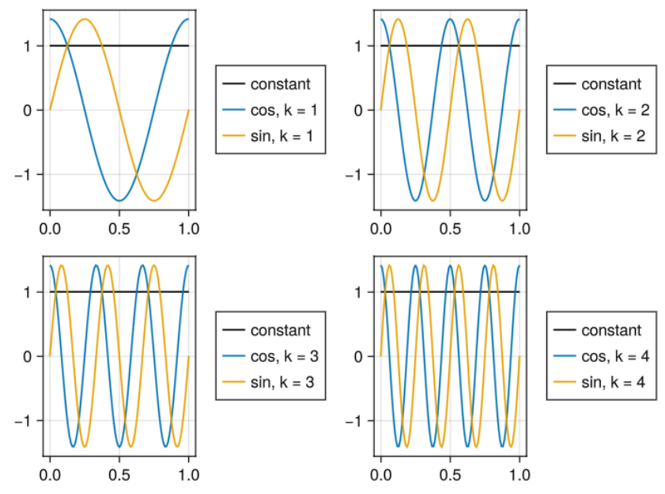

import Gif from "../../components/Gif.astro";

Clickbait title: My [3Blue1Brown](https://www.youtube.com/@3blue1brown) callout post

Nah, Grant (the guy behind the channel) is great, and his videos are genuinely amazing. He does, however, perfectly illustrate my issue with mainstream "pop science" math content. And that is, that it is *too* mainstream. Him, and most other very popular math youtubers, take a very geometric and visual approach, which is great when you're going for a broad appeal, but can counterintively be harmful if you're trying to learn in a more professional setting (like university). 

This actually happened to me, specifically with 3Blue1Brown, when I was first doing my linear algebra course some years ago. Picture this; An over-eager 2nd semester physics student, about to have their first *proper* math course (Linear Algebra). What does she do in preparation? Well, she of course binges the very popular video series by this new math channel she just discovered, 3Blue1Brown, on that very subject! How handy! Well imagine my surprise when I had my first lecture, and there were no mentions of matrices, and no awesome animations of shifting coordinate grids. Instead, it's all just sets of linear equations! And here comes my gripe with that particular video series; it is called the "essence of linear algebra", but is focused entirely on a geometric view. And thus, I feel like it misses the (to me) *actual* essence of linear algebra. The algebraic manipulation of systems that behave linearly. 

I will not be spending too much time on explaining what linear algebra is, I'm assuming that you have at least a base understanding of it, though I will go through the core concepts needed to derive fourier analysis.

## Linearity

I keep using this word, linear, but what does it actually mean? Those with a high school level understanding of math will probably be thinking of straight lines, the classic $$f(x) = ax+b$$, and while that isn't *wrong*, it is very far from the full picture. So here is the most basic idea of linearity; If you have an operator, $$L(x)$$, it is said to be linear if the following holds:

$$
L(a \cdot \boldsymbol{u}) = a \cdot L(\boldsymbol{u})
\newline
L(\boldsymbol{u}+\boldsymbol{v}) = L(\boldsymbol{u}) + L(\boldsymbol{v})
$$

What is a, u, and v? Well, a is what is called a scalar, which is what normal people call "a number". And what about **u** and **v**? They're what's called "vectors". What's a vector? Weeellllll, it's *complicated*. To many, a vector is simply a collection of numbers in a list, but to be able to derive fourier analysis, we have to be a little bit more general. A vector is an element of a vector space. Huh. Okay, but what's a vector space? Well, it's a set of elements that obey certain properties. Oh.

So that's kind of unhelpful. Understanding exactly what a vector is will require a full university level course, and I will not be going into *that* much detail here. For this blog post, it is sufficient to know of two types of vector spaces; $$ℝ^n$$ and $$L^2[a,b]$$ (pronounced R n and L-square). $$ℝ^n$$ is the classic collection of vectors we all know and love. It is a list of n numbers. 

$$L^2$$ is a little different. It is the collection of all functions, f(x), that take a real number, $$a < x < b$$, and return a complex number, and which fullfill the following property:

$$
\int_a^b |f(x)|^2 dx < \infty
$$

The above inequality may seem quite intimidating, but it's *integral* to understanding this blog post, so we'll spend a lot of time examining it, and another related integral. Also do note that there is an infinte number of different $$L^2[a,b]$$ vector spaces
But first, we must take a small detour to talk about the normal vector dot product.

## The Inner Product
Okay I lied. It's called the inner product. The dot product is simply the specific term for the inner product for the $$ℝ^n$$ vector spaces. The generalized inner product equation is:
$$
\langle \boldsymbol{u},\boldsymbol{v} \rangle = |\boldsymbol{u}||\boldsymbol{v}|cos(\theta)
$$
Where **u** and **v** are vectors (the normal kind), the || denote the "length", and θ is the angle between them. For the normal dot product, it is customary to substitute the angle brackets for a dot:
$$
\boldsymbol{u} \cdot \boldsymbol{v} = |\boldsymbol{u}||\boldsymbol{v}|cos(\theta)
$$
A nice visualization of the dot product can be found on wikipedia. Here they have used **x** and **y**, where as we used **u** and **v**.

Alright so the dot product can be used to find the angle between two vectors, but how do you compute it? Well, that depends entirely on what vector space you exist in. For $$ℝ^n$$, you have:
$$
\boldsymbol{u} \cdot \boldsymbol{v} = u_0 v_0 + u_1 v_1 + ...  + u_n v_n
$$
This definition almost begs of you to ask: what happens if you take the dot product of a vector with itself? Well, that gives you the "norm squared", aka the length squared:

$$
\boldsymbol{u} \cdot \boldsymbol{u} = u_0^2 + u_1^2 + ... + u_k^2 = |\boldsymbol{u}|^2
$$
Which fits well with our intuition from pythagoras. We will now define the length of a vector (of any vector space with a defined inner product) as such:

$$
|\boldsymbol{u}| = \sqrt{\langle \boldsymbol{u},\boldsymbol{u} \rangle}
$$
I will now define the inner product for the $$L^2$$ vector space (the weird one that is a collection of functions), and then I will attempt to justify it afterwards, but to be completely honest, I don't entirely know where it came from. **BUT**, with that said, it is an awefully useful definition, and it is that from which the fourier series falls out of!

$$
\langle f,g \rangle = \int_a^b f(x) \overline{g(x)}dx
$$
The line above the g(x) means the [complex conjugate](https://en.wikipedia.org/wiki/Complex_conjugate). Remember that f and g are functions of $x \in [a,b]$, which return a complex number, and that fullfill the earlier criterion. Just a quick reminder for those who are a bit rushy with complex numbers, given a complex number z: $z\overline{z} = |z|^2$ where || denote the norm (absolute value).

With this definition of the inner product, we can now rewrite the criterion as:

$$
\langle f,f \rangle  = \int_a^b |f(x)|^2 dx < \infty
$$
So the criterion is that the functions in $$L^2$$ have finite length. 

In the field of signal analysis, we have the concept of an energy signal and a power signal. In general, we say that the energy of a signal, $s(t)$ is proportional to it's square integral:

$$
E \propto \int_{t_0}^{t_1}s(t)^2 dt
$$

And the power is then:

$$
P \propto \frac{1}{t_1 - t_0}\int_{t_0}^{t_1}s(t)^2 dt
$$
We say a signal is an energy signal, if it's energy is finite, and it's a power signal if it's energy is infinite, but power is finite. That first integral may look suspiciously like the $L^2[t_0,t_1]$ inner product, which would be because it is. So $L^2[t_0,t_1]$ is the collection of all energy signals. To do a bit of foreshadowing, we consider energy signals when doing the fourier series, and power signals when doing the fourier transform. What do all those words mean? We'll get to it!

## Projections
There is just one more concept we need to touch on before we're ready to tackle fourier analysis, and it is, as the heading suggests, projections. 

If we want to project one vector onto another as such:

This can be written, in linear algebra terms, as:

$$
\boldsymbol{u}_{onto_{\boldsymbol{v}}} = \frac{\langle \boldsymbol{u}, \boldsymbol{v} \rangle}{\langle \boldsymbol{v}, \boldsymbol{v} \rangle} \boldsymbol{v}
$$
It can be thought of as a new vector with length proportional to the angle between **u** and **v** in the direction of **v**. Alright cool, but why do we care? In many applications, it can be very useful to rewrite a vector as a weighted sum of other vectors. 

To give a simple example of this, consider the vector $$\boldsymbol{w} = [3,1]$$, and say we want to write it as a weighted (linear) sum of the two vectors $$\boldsymbol{u} = [1,1]$$, $$\boldsymbol{v} = [1,-1]$$:

$$
\boldsymbol{w} = \frac{\boldsymbol{w} \cdot \boldsymbol{u} }{\boldsymbol{u} \cdot \boldsymbol{u}}\boldsymbol{u} 
    + \frac{\boldsymbol{w} \cdot \boldsymbol{v}}{\boldsymbol{v} \cdot \boldsymbol{v}}\boldsymbol{v}
$$
$$
\boldsymbol{w} = \frac{3\cdot1 + 1\cdot 1}{1\cdot1+1\cdot1} \boldsymbol{u} + \frac{3\cdot1 + 1\cdot (-1)}{1\cdot1+(-1)\cdot(-1)} \boldsymbol{v}
$$
$$
\boldsymbol{w} = 2 \boldsymbol{u} - 1\boldsymbol{v} = 2[1,1] + [1,-1] = [3,1]
$$
## The Fourier Series
I'm going to say some words, and then we'll go through what it means after: The set of functions

$$
f(t) \in \left\{\sqrt{\frac{w}{2\pi}},\sqrt{\frac{w}{\pi}}\textrm{sin}(kwt),\sqrt{\frac{w}{\pi}}\textrm{cos}(kwt)\right\}
$$
For all values of $$k \in [1,2,3....]$$, with $w=\frac{2\pi}{t_1 - t_0}$, such that sin(kwt),cos(kwt) will always complete k cycles in the range $[t_0,t_1]$, form an orthonormal basis of $$L^2[t_0,t_1]$$:

Firstly, yes, $f(t) = \sqrt{\frac{w}{2\pi}}$ is a valid function of $t$. Remember that $w$ is just a number determined by $[t_0,t_1]$. Secondly, what the hell is an "ortonormal basis". Let's start with that second word, basis. Essentially (and I'm skipping a lot of detail here), it's a set of vectors in a vector space, such that you can reach any other vectors in that space via a weighted sum of the basis vectors. The simplest example is $$\boldsymbol{e_1} = [1,0], \boldsymbol{e_2} = [0,1]$$ of $$ℝ^2$$. You can reach any 2 dimensional vector as a weighted sum of those two:
$$
[x,y] = x\boldsymbol{e_1} + y\boldsymbol{e_2}
$$
Orthonormal means a set of vectors are both orthogonal, and normal. A vector is normal if it has length 1, i.e.:
$$
\langle \boldsymbol{u}, \boldsymbol{u} \rangle = 1
$$
That's what all those constants in front of the sines and cosines are. They're simply there to make sure they have length 1. Why we want to do that becomes apparent a little later.

For $$ℝ^n$$, orthogonal means they're perpendicular:

 In more general terms, it means their inner product is zero:
$$
\langle \boldsymbol{u}, \boldsymbol{v} \rangle = 0
$$
Wait sine and cosine are perpendicular? Well, kinda. At least by the definition of perpendicularity. That may sound odd, but it is exceedingly useful. And just to prove it real quick:

$$
\begin{align*}
\langle \textrm{cos(nwt)},\textrm{cos(mwt)} \rangle &= \int_{t_0}^{t_1} \textrm{cos(nwt)cos(mwt)}dt
\newline
&=\int_{t_0}^{t_1}\frac{1}{2}\textrm{cos((n-m)wt)+cos((n+m)wt)}dt
\end{align*}
$$
The integral over a whole number multiple of a full period of a sine or cosine is zero, so the only values of n,m that are different from zero is when $n=m$. Thus, the above integral is zero for all $n \neq m$. It is fairly trivial to show that the same is true for all sines, and for the cross of all sines and cosines. 

The last fact we're missing, is that the inner product is a linear operator itself:
$$
\langle af+bg,h\rangle = a\langle f,h\rangle + b\langle g,h \rangle
$$
Perhaps you see where this is going. Firstly, to simplify the math, we will be working in $L^2[0,1]$, but the following still applies without loss of generality. This means our basis functions become:

$$
f(t) \in \left\{1,\sqrt{2}\textrm{sin}(2\pi kt),\sqrt{2}\textrm{cos}(2\pi kt)\right\}
$$
Now, let us project an arbitrary function $s(t)$ in our vector space onto one of our basis vectors, say $\sqrt{2}\textrm{cos}(2\pi kt)$

From the definition of projection:
$$
\begin{align*}
s(t)_{onto_{cos(kt)}} &= \frac{\left \langle s(t) , \sqrt{2}\textrm{cos}(2\pi kt)\right \rangle}{\left \langle \sqrt{2}\textrm{cos}(2\pi kt) , \sqrt{2}\textrm{cos}(2\pi kt)\right \rangle} \sqrt{2}\textrm{cos}(2\pi kt)
\newline
&= 2\left \langle s(t) ,\textrm{cos}(2\pi kt) \right \rangle \textrm{cos}(2\pi kt) 
\newline
&= \left(2\int_0^1s(t)\textrm{cos}(2\pi kt) dt \right) \textrm{cos}(2\pi kt) 
\end{align*}
$$

Where we have used the fact that we normalized the cosine (it's inner product with itself is one). We'll call the stuff in the parentheses $a_k$. The same procedure can be applied to the projection onto $\sqrt{2}$sin$(2\pi kt)$:
$$
\begin{align*}
s(t)_{onto_{sin(kt)}} &= \left(2\int_0^1s(t)\textrm{sin}(2\pi kt)dt \right) \textrm{sin}(2\pi kt)
\end{align*}
$$
Where we'll call the stuff in the parentheses $b_k$. Lastly we need to deal with the constant term, $$f(t) = 1$$:
$$
\begin{align*}
s(t)_{onto_{constant}} &= \frac{\left \langle s(t) , 1\right \rangle}{\left \langle 1,1\right \rangle} 1
\newline
&= \left \langle s(t) , 1 \right \rangle
\newline
&= \int_0^1s(t)dt
\end{align*}
$$
Which we will call $a_0$. We now have a recipe for rewriting our function $s(t)$ as a sum of sines and cosines:

$$
\begin{align*}
s(t) &= a_0 + \sum_{k=1}^\infty a_k \textrm{cos}(2\pi k t) + \sum_{k=1}^\infty b_k \textrm{sin}(2\pi k t),
\newline
a_0 &= \int_0^1s(t)dt
\newline
a_k &= \left(2\int_0^1s(t)\textrm{cos}(2\pi kt) dt \right)
\newline
b_k &= \left(2\int_0^1s(t)\textrm{sin}(2\pi kt) dt \right)
\end{align*}
$$

And that right there *is* the fourier series. However, there is a slightly nicer way to write it, if we allow ourselves to use complex exponentials instead.

Consider the basis functions of $L^2[0,1]$:
$$
f(t) \in \left\{e^{2\pi i k t}\right\}, k \in \{...,-1,0,1,...\}
$$
So now we just have one category of basis function, and we allow k to be all integers. Note that this set of basis functions are already normalized. Using [Euler's formula](https://en.wikipedia.org/wiki/Euler%27s_formula) it is trivial to show that these two sets are equivalent. Let's project our function $s(t)$ onto this set of basis functions:

$$
\begin{align*}
s(t)_{onto_{exp}} &= \frac{\left \langle s(t) ,e^{2\pi i k t} \right \rangle}{\left \langle e^{2\pi i k t} , e^{2\pi i k t}\right \rangle} e^{2\pi i k t}
\newline
&= \left \langle s(t) ,e^{2\pi i k t} \right \rangle e^{2\pi i k t}
\newline
&= \left (\int_0^1 s(t) e^{-2\pi i k t} \right) e^{2\pi i k t}
\end{align*}
$$
Where we'll call the stuff in the parentheses $c_k$. Note the sign of the exponential in the integral. This is due to the fact that you take the complex conugate of the second argument in the inner product, and the complex conjugate of a complex exponential is: $\overline{e^{ix}} = e^{-ix}$.

We may now rewrite $s(t)$ as this projection, like we did before:
$$
\begin{align*}
s(t) &= \sum_{k=-\infty}^{\infty} c_k e^{2\pi i k t},
\newline
c_k &= \int_0^1s(t)dt
\end{align*}
$$