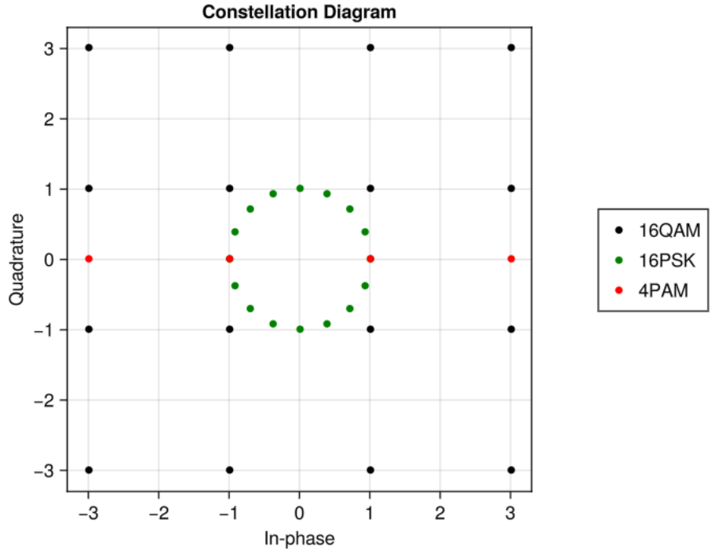

import Gif from "../../components/Gif.astro";

I want this blog post to feel like a natural exploration of digital wireless communications, and for you to feel like you could've come up with these concepts yourself.

# Communication Systems
I feel like the best place to start is to consider what it is we want to accomplish in communication systems. 

Let's consider a real example, AM radio. The signal starts out as sound, in the form of changes in air pressure. This gets picked up by a microphone, which turns the air pressure into an electrical signal. If we want to actually broadcast this signal far, and to many users, we're gonna want to do it wirelessly. And here, we have essentially two options; use sound or use light. The first option is a speaker, and thus not really appropriate for long-range broadcasting. Thus, we will choose the second option, light.

But how do you encode an electrical signal onto light? We could just attempt to send the signal directly as light, but we'll discover very quickly that the resulting light wave would have a wavelength on the order of hundreds of kilometers, meaning we'd need an antenna of roughly that size. Instead, we want to somehow imprint the information of the signal onto a light wave of a much higher frequency. One simple option is to simply use the signal as the amplitude of a pure frequency of light:
$$
x(t)=s(t)\cdot\mathrm{cos}(2\pi f_c t + \phi)
$$
Where s(t) is the signal we picked up from the microphone, $f_c$ is the "carrier" frequency, meaning the frequency of light we're imprinting upon, $\phi$ is an initial phase shift, which will be assumed to be zero going forwards, and x(t) being the resulting *modulated* signal. This is, essentially, one version of AM, Amplitude Modulation, radio. 

Generally, there are three different ways to imprint a signal onto a pure carrier, amplitude modulation, as we just did, phase modulation, where $\phi(t)$ carries the information, and frequency modulation, where $f_c(t)$ carries the information. This is also what FM radio is. To begin with, we will just consider amplitude modulation, and once we introduce digital modulations then pulse modulation will also be considered. Lastly, while there are some applications where frequency modulation is used, both in analog and digital signals, they will not be discussed here.

Before we start looking at how to demodulate our signal, we need to take a quick at complex numbers, and especially complex exponentials.

## The Role of the Complex Exponential
I'm writing this next section with the assumption that you have at least a general idea of how complex numbers work. If not, there are lots of great resources out there! Additionally, I am just going to introduce the complex exponential without justifying why it's true; as this is really not relevant for this discussion. If you want a better introduction, check out this [3Blue1Brown video](https://www.youtube.com/watch?v=v0YEaeIClKY)!

Without further ado, here is the complex exponential:
$$
\mathrm{e}^{it}=\mathrm{cos}(t)+i\mathrm{sin}(t)
$$
The reason we care about it so much has to do with the Fourier transform. [See my other blog post for an introduction](https://hannah.cramt.dk/blog/fourier_linear_algebra/)! This next part might feel slightly unsatisfactory for some, but proving specific properties of the Fourier transform is, 1. beyond the scope of this blog post, and 2. kind of uninteresting. Expressing sine and cosine in terms of the complex exponential yields:
$$
\mathrm{cos}(t)=\frac{1}{2}(e^{i t}+e^{-i t})
$$
$$
\mathrm{sin}(t)=\frac{1}{2i}(e^{i t}-e^{-i t})
$$

Assuming we have some signal in time, $s(t)$, which is in $L^2$, which just means it has finite energy, then you can take the Fourier transform of it to get:
$$
S(f)=\mathcal{F\{s(t)\}}
$$
$S(f)$ tells you something about the strength of different pure sines and cosines of different frequencies for the entire signal. The property of the Fourier transform we need is
$$
\mathcal{F\{s(t)\cdot e^{2\pi i f_c t}\}}=S(f-f_c)
$$
So multiplication by a complex exponential with frequency $f_c$ causes a shift in the Fourier transform of your signal. And multiplication by cosine causes two copies shifted by $\pm f_c$ and scaled down by two:
$$
\mathcal{F\{s(t)\cdot \mathrm{cos}(2\pi f_c t)\}}=\frac{1}{2}(S(f-f_c)+S(f+f_c))
$$
Multiplying by cosine again causes the two splits to split again;
$$
\mathcal{F\{s(t)\cdot \mathrm{cos}(2\pi f_c t)^2\}}=\frac{1}{4}(2S(f)+S(f-2f_c)+S(f+2f_c))
$$
Now, if we were somehow able to get rid of these far-out copies of the signal, we could reconstruct $s(t)$. However, there is one small complication we must first discuss, namely the bandwidth of our signal $s(t)$. For us to be able to use this type of modulation, our signal must be band-limited, meaning there exists a frequency B for which:
$$
S(f) = 0 \qquad \mathrm{if} \;|f|\ > B/2
$$
The smallest B for which the above equation holds is called the bandwidth of the signal. If such a B does not exist (meaning the signal extends infinitely in frequency), then the modulation scheme we've chosen won't work, as the copies will overlap. Additionally, it is fairly easy to show that $f_c > B/2$ is sufficient to guarantee that we can demodulate our signal. However, we still need to actually remove these high-frequency copies of our signal, and this can be accomplished with something called a low-pass filter. Without going through it in massive detail, they simply attenuate components with frequencies above a certain frequency, while allowing those below to pass. And as such, we can retrieve the original analog signal from the modulated one, by multiplying by the same cosine, and passing it through a low-pass filter. One practical note on real low-pass filters, is that they are not brick-wall style blockers, and so in practice you want more distance between the upper occupied frequencies, and the carrier frequency.

However, this is just analog signals, and since most of the world today is digital, we need to change things up a bit.

## Digital Modulation
Digital modulation differs from analog by having a discrete set of "symbols", which get modulated onto a carrier. Same as before, there are three ways to imprint our information, amplitude, phase and frequency. I won't cover digital frequency modulation in this blog post, as it's not really used in high throughput modern systems. However, before we get too deep in the weeds, let's consider a simple modulation scheme, similar to AM radio.

First we must map our digital information to actual signal values, so let's say a '1' is represented by 1V, and a '0' by -1V. Our signal then becomes:

$$
x(t)=\begin{cases}
\mathrm{cos}(2\pi f_c t + \phi) & \qquad \mathrm{if} \; s(t) = 1 \\
-\mathrm{cos}(2\pi f_c t + \phi) & \qquad \mathrm{if} \; s(t) = 0
\end{cases}
$$
This symbol mapping is called Binary Phase-Shift Keying, BPSK, and is one of the simplest digital symbol mappings. In general, many different symbol mappings are used, and one, named MQAM, will be introduced further on.

As you might be able to intuit, this description is not only discrete in levels, but also in time. We must impose some duration of symbol before we'd be able to decode it, otherwise it would be impossible to separate when identical symbols are transmitted in a row. Let's call this quantity $T_s$.

In this sort of simple digital pulse and amplitude modulation, a pulse shaping function is often utilized. In the above example we have implicitly used a rectangular pulse shape, with discontinuities between different symbols (for example, it goes from +1 to -1 when switching from a 1 to a 0). This rectangular pulse in time corresponds to what's called a sinc pulse in frequency, which increases the bandwidth. Rewriting the above example with an arbitrary pulse shaping function we get:
$$
x(t)=\begin{cases}
g(t)\mathrm{cos}(2\pi f_c t + \phi)&  \qquad \mathrm{if} \; s(t) = 1 \\
-g(t)\mathrm{cos}(2\pi f_c t + \phi)&  \qquad \mathrm{if} \; s(t) = 0
\end{cases}
$$
Where $g(t)$ is a pulse shaping function, such as a [Root-Raised Cosine](https://en.wikipedia.org/wiki/Root-raised-cosine_filter).

Before considering the main issue with this approach to digital wireless transmission, I will first introduce some more sophisticated symbol shaping techniques.

### Symbol shaping
One interesting property of the Fourier transform is that the transform of a purely real signal (so no imaginary part) is always conjugate symmetric, meaning $S(f)=S^*(-f)$, where the $*$ means the complex conjugate. This means that any purely real signal is only effectively using half of its occupied bandwidth. While there are several solutions to this issue, the one we're gonna consider is complex modulation schemes, i.e. allowing our digital baseband signal to be complex. 
$$
s(t)=s_I(t) + i s_Q(t)
$$
Where $s_I(t)$ is called the in-phase, or real, component, and $s_Q(t)$ the Quadrature, or imaginary, component. The modulation also utilizes a complex exponential, but when we actually want to transmit the signal, we must convert it to a fully real one. Mathematically, it looks like:
$$
x(t) = \mathcal{R}\{s(t)e^{2\pi i f_c t}\}=s_I(t)\mathrm{cos}(2\pi f_c t) - s_Q(t) \mathrm{sin}(2\pi f_c t)
$$
To demodulate, we split the signal and multiply each copy by cos and sin respectively:
$$
\begin{cases}
x(t)\mathrm{cos}(2\pi f_c t)=\frac{1}{2}s_I(1+\mathrm{cos}(4\pi f_c t))-\frac{1}{2}s_Q\mathrm{sin}(4\pi f_c t) &\\
x(t)\mathrm{sin}(2\pi f_c t)=-\frac{1}{2}s_Q(1-\mathrm{cos}(4\pi f_c t))+\frac{1}{2}s_I\mathrm{sin}(4\pi f_c t) &
\end{cases}
$$
And then using a low-pass filter to remove the high-frequency components. For those curious, this works because sin and cosine are mutually orthogonal, as shown in [my previous blog post](https://hannah.cramt.dk/blog/fourier_linear_algebra/).

But by using complex values for our signals, we can effectively double our data rate at very little cost. When letting $s_I$, $s_Q$ be $\pm 1$, we get what's called Quadrature Phase-Shift Keying, QPSK. 

We can also introduce several more allowable values, rather than just $\pm 1$. One scheme like this is rectangular M-ary Quadrature Amplitude Modulation, MQAM. For example, by allowing $\pm 1$, $\pm 3$ for both the in-phase and quadrature components, we get 16 different possible combinations, hence this is called 16QAM. In general, this modulation scheme can be inspected in what's called a Constellation Diagram, which is a plot of the allowed MQAM levels, with the x-axis showing the real part, and the y-axis being the imaginary part. Below is a constellation diagram of a few different complex symbol shape schemes.

In general, the greater the distance between points, the better the resistance to noise. 

However, this simple sort of digital modulation, which is called a single-carrier scheme, has issues when it comes to high-throughput systems. 

### Intersymbol Interference
Imagine sitting in a room with a transmitter-receiver pair. If you transmit a single pulse, for example a single modulated symbol. Listening at the receiver for this pulse, you'll notice two things. Firstly, it takes a bit of time from when it was transmitted, to when you see it. This is due to the finite speed of light, which is roughly 300'000 kilometers per second. However, there is a second observation you'll likely make, and one that has far reaching consequences. You see several attenuated and delayed copies of the pulse. In wireless communications we have a word for this concept, multipath components, and we generally associate one number, the Delay Spread, with how much the signal gets smeared. It's the Root Mean Square of the arrival power at different times of all multipath components, and has symbol $\sigma_{T_m}$. 

Now consider that we repeat this pulse with a period of $T_s$, which is on the order of the delay spread. What we'll see is that the pulses will start to become indistinguishable, as the symbols start to interference with each. This is called Intersymbol Interference (ISI), and it's a major problem in wireless communications. For many indoor environments, the delay spread is generally on the order of [100 ns](https://www.ieee802.org/11/Documents/DocumentArchives/1997_docs/71252.pdf). A general rule of thumb is that your symbol time, $T_s$, should be greater than 10 times the delay spread of your environment. This means we're limited to a symbol rate of:
$$
T_{s_{\mathrm{max}}}\approx \frac{1}{10\cdot 100\; \mathrm{ns}}= 1\; \mathrm{MHz}
$$
This means that without dealing with ISI, we're essentially limited to data rates in the low MHz, which is not sufficient for modern communication systems. As such, we need a better way.

### Multicarrier Modulation
One idea is to take your high-speed sequential symbol stream, and turn it into several slower, parallel symbol streams, each modulated onto their own carrier. Previously we've used $T_s$ to mean both sample period and symbol period. From now on, $T_s$ will mean sample period, and $T_u$ will mean symbol period. Writing it out mathematically:
$$
x(t) = \sum_{k}s_ke^{2\pi i f_k t}
$$
So the output stream, $x(t)$, is a sum over k parallel symbol, each with a symbol time $T_u$, and separate carrier frequency $f_k$. The main question now is, what should the sequence of carrier frequencies $f_k$ be, in order to ensure no intercarrier interferece, while being as spectrally efficient as possible?

As was discussed on my previous blog post on Fourier Analysis, we showed that sine and cosines with frequencies spaced by integer multiples of $1/T_s$ are orthogonal. So one idea is to set $f_k=k/T_s$. Writing this out, we get:
$$
x(t) = \sum_ks_ke^{2\pi i \,k/T_s \, t}
$$
And this is actually exactly the equation for the Inverse Discrete Fourier Transform. This is called Orthognonal Frequency Division Multiplexing, OFDM, and is one of the cornerstones of modern wireless communication systems! In practice, this is implemented digitally using the Inverse Fast Fourier Transform. However, there is one more issue that must be dealt with. 

When transmitting wirelessly, the channel will generally have memory, which comes from multipath components, and if we were to just run consecutive OFDM symbols with no space between them, we'd still get Intersymbol Interferece. In a single-carrier approach, we used pulse shaping to avoid this, however in OFDM we use a different technique, called a cyclic prefix. Essentially, we take the last few samples, and prepend them in front of the whole OFDM symbol, essentially increasing its length. The length of the cyclic prefix should be greater than the delay spread. 

One question that I had when I was first learning about OFDM is, why not just use a guard band, so all zeros, rather than a cyclic prefix? It would use less energy! This is a very valid question, and the answer is honestly kind of complicated. But without going too deep into the details, it has to do with the fact that applying a channel response to an aperodic signal is what's called a linear convolution, but the FFT done in the decoder on the receiver requires it to be a circular convolution, meaning the signal has to, within the memory of the channel, look like a periodic signal. 

As an example, I recently implemented OFDM as part of my bachelor project, which was on the [Design and Implementation of an FPGA-based Software Defined Radio Transmitter](https://github.com/HannahField/VHDL-SDR), and here I used a sample rate of $50$ MHz, assumed delay spread of 100 ns, and an OFDM subcarrier amount of 1024 (with only 256 being active), meaning a cyclic prefix of 8 samples yields a length of $T_{CP}=8/50$ MHz $= 160$ ns, which is greater the delay spread of 100 ns. This means, in the time domain, the length of a full OFDM symbol, including cyclic prefix, is $1024 + 8 = 1032$, with a symbol time of $T_u = 1032 / 50$ MHz $ = 20.64 \mu$s.

### The issue of Peak-to-Average-Power
OFDM has one big problem, which is its the large peak-to-average-power ratio (PAPR). This means all components further on in the chain (DAC, amplifiers), have to behave nicely for a much larger power range, which generally leads to more overall power consumption and more expensive components. To give some intuition as for why this is the case, we will consider an OFDM symbol stochastically. Notice that, generally speaking, each subcarrier in the sum is independent, and also likely identically distributed. This means the output is a large sum of many independent and identically distributed, i.i.d, complex numbers. As such, we can invoke the central limit theorem, which means $x(t)$ will generally follow a complex Gaussian distribution. The power distribution arising from a signal following a complex Gaussian is an exponential distribution, which generally has quite an unbounded tail. As such, while most of the energy is concentrated around the mean, very large peaks can occur with a fairly high probability. Do note that the Gaussian distribution is not a perfect model, as there is a maximum possible amplitude, and this power, which happens when all subcarriers align perfectly.

One way of combatting this issue is to ensure that the subcarriers are not i.i.d. This can be done, for example, by doing a discrete fourier transform of the active subcarriers first, and then doing a full IFFT on that, padded with zeros to fit the size of the OFDM symbol. This modulation is called Single-Carrier Frequency Division Multiple Access, SC-FDMA. While OFDM is used in both WiFi and Cellular, SC-FDMA is primarily used for cellular uplinks, so from phone to cell tower, as the power consumption is more important than the added computational complexity.

