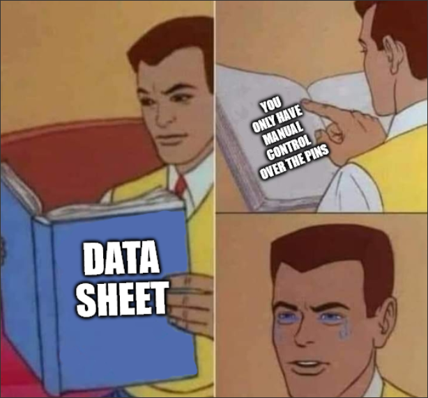

import Gif from "../../components/Gif.astro";

import led from "../../assets/led.mp4";
import inv_led from "../../assets/inv_led.mp4";
import hex_broken from "../../assets/hex_broken.mp4";
import hex_working from "../../assets/hex_working.mp4";
import all_numbers_working from "../../assets/all_numbers_working.mp4";
import counter_working from "../../assets/counter_working.mp4";
import vers_counting_broken from "../../assets/vers_counting_broken.mp4";
import vers_counting_working from "../../assets/vers_counting_working.mp4";

## Introduction

Heya. This blog post is about my exploration with the Altera DE2 development and education FPGA board! Why this one? We'll get to it!

Let's start somewhere else: Why am I even exploring FPGA boards? As an Electrical Engineering student, some of my fields of interest have been:

- Communication systems
- Signal processing
- Programming (Especially low-level things like drivers)
- The interaction between the physical and digital world

There are other things I've found enjoyable, but they're not super related to Electrical Engineering (things like scientific computing and data analysis come to mind!). A possible way to explore all the above fields is via an FPGA, and thus, the course is set. (I must also say that I have used an FPGA before, in class. Specifically the [Zybo Z7](https://digilent.com/reference/programmable-logic/zybo-z7/start), however, I desire to do some exploration on my own, and so here we are.)

## Getting started

So, FPGAs, where to start? Finding an actual board seems like a good idea. Luckily, I study at a pretty awesome university, and so they have a giant stock of, well, everything an Electrical Engineer could ever dream of, free to borrow! For FPGAs, there was basically just the one option though, [an Altera DE2](https://www.terasic.com.tw/cgi-bin/page/archive.pl?Language=English&CategoryNo=183&No=30&PartNo=1#contents). While it is quite old, it does have some awesome features, including a 16x2 LCD panel. This will do nicely!

The first thing to do is getting a good idea for a project! Actually, the real first thing to do is figure out how to hook up this ancient piece of hardware to modern technology. All the info that came with this thing is from 2006, and on a bloody CD. So:


And we're back. It seems like the best option is [Intel's Quartus II](https://www.intel.com/content/www/us/en/software-kit/711791/intel-quartus-ii-web-edition-design-software-version-13-0sp1-for-windows.html), though it has to be a slightly older version, since they discontinued support for architecture of my FPGA, which is called Cyclone II... Hm. Anyways, let's install it.


Dang that took a while. With that out of the way, it is now time to figure out how to actually use it. I watched [this youtube video](https://www.youtube.com/watch?v=auQ7wpVH-0Q) from 2012, however basically nothing has changed with the software since then. I guess enterprise software has a much longer half-life than basically the rest of the software world. Huh.

There is just one last thing to do before actually getting started though; a choice has to be made. What language? For this initial project, I will be using [VHDL](https://en.wikipedia.org/wiki/VHDL), since it's what I used in class, however, I really want to try the [Scala framework, Chisel](<https://en.wikipedia.org/wiki/Chisel_(programming_language)>) at some point! I would also like to move away from Quartus at some point, though I feel like I'm getting ahead of myself. Firstly I actually gotta put something on the damn thing!

## Hello... LED?

Let's boot it up! Alright, create new project (with the provided new project wizard 🧙‍♂️). Yeah yeah, I know how projects work. Just gotta figure out what my FPGA is called. It should say on the chip...


Why is the text _so_ tiny? Anyways, it's an EP2C35F62C6N of type Cyclone II... Which is not an option. There is one without the N, that must be it (I hope).

Project? Set up. Language? Chosen. Let's get started! From that previously mentioned video, we know how to create a new design file! New -> VHDL. Let's just get something really simple on there, like pressing a button turns on an LED! Should be easy. Wait, how do you even write VHDL?? Maybe I should go back through my old course, just for a quick refresher.


I'm just gonna borrow some code from an old lecture and modify it to fit;

```vhdl
-- Import packages
library ieee;
use ieee.std_logic_1164.all;

-- Declare the entity
-- Meaning, what are the inputs and outputs
entity hello_world is
    port(
        -- a is an input of type std_logic
        a : in std_logic;
        -- led is an output, also of type std_logic
        led : out std_logic);
end hello_world;


-- Here is where the actual code goes.

architecture dataflow of hello_world is
    begin
        -- led is a, seems simple?
    led <= a;
end dataflow;

```

According to that video, we should compile it once, such that it automatically sets up which IO needs pin assignments. Lets assign the input a to... KEY3? And the output to LEDG6, which is just above it. Aaaaand I need to find the datasheet, since the printed pin names aren't aliased into Quartus... Alright, KEY3 is PIN_W26 and LEDG6 is PIN_AA20. Let's flash it onto the board! 


According to the datasheet, to store your program on the FPGA in a non-volatile manner, you have to use "Active Serial Programming". Just gotta set the mode select switch to PROG, turn it on, click the programmer button in Quartus, and set the mode to Active Serial Programming... And it doesn't work...?

After doing some experimentation, it turns out I have to recompile, click add file and choose the .pof file, and then click Program/Configure 🤷‍♀️ But it works now, so just turn it off, flip the switch into run mode, and turn it back on!

<Gif url={inv_led} />

So, two issues. First, why are the 7-segment displays on? And secondly, why does the button seem to be inverted? Erh, one thing at a time, so let's just ignore the the 7-segment displays for now. I genuinely have no clue why the button seems to be inverted, but there is an easy fix, sooo, eh?

```vhdl
architecture dataflow of hello_world is
    begin
        -- led is not a, apparently not that simple 🤷‍♀️
    led <= not a;
end dataflow;
```

Let's get that onto the board so we can see it working:

<Gif url={led} />

Perfect!

## Put numbers on it

Well that wasn't terribly exciting. BUT! I figured out how to interact with the physical world, which is a good first step! I kinda want to do something about those 7-segment displays, so let's maybe display a number that has been set via the switches? Let's dive into the datasheet!



Oh dear. So it seems like I only have access to the pins directly, with no BCD to 7 segment decoder or anything... While it is nice to have direct access for maximum control, it would've been neat to also have a decoder, alas it seems like I gotta write my own. This feels like a good opportunity to learn about how to make my own functions in VHDL, to avoid the massive amount of code duplication I would otherwise need, to display numbers on each of the 7 segment displays.


That took a lot longer than I expected. It appears that functions have to exist within an architecture, so let's create a quick lil entity that has vector of switches as it's input, and the output is the 7 segments of the display.

```vhdl
entity draw_7seg is
    port(
    -- There are 17 switches
    SW : in std_logic_vector(0 to 17);

    -- HEX0 is a specific 7-segment display
    HEX0 : out std_logic_vector(0 to 6));
end draw_7seg;
```

Next we gotta create the architecture body. I have no idea what to name it, but I don't think it matters? For this, I'm gonna define a [signal](https://nandland.com/variables-vs-signals/) to store the number we get if we interpret the state of the switches as binary. Now I just gotta write the function that turns a single digit number into which segment needs to be turned on.

```vhdl
architecture dataflow of draw_7seg is

    -- A signal (basically meaning a variable)
    -- num is used to the integer
    -- of what the switches are set to
    signal num : integer := 0;

function num_to_7seg(
    input : in integer)
    return std_logic_vector is
    variable output : std_logic_vector(6 downto 0);
begin

    if (input = 0) then
        output := "1111110";
    elsif (input = 1) then
        output := "0110000";
    elsif (input = 2) then
        output := "1101101";
    elsif (input = 3) then
        output := "1111001";
    elsif (input = 4) then
        output := "0110011";
    elsif (input = 5) then
        output := "1011011";
    elsif (input = 6) then
        output := "1011111";
    elsif (input = 7) then
        output := "1110000";
    elsif (input = 8) then
        output := "1111111";
    elsif (input = 9) then
        output := "1111011";
    else
        output := "0000000";
    end if;
    return std_logic_vector(output);
end num_to_7seg;

begin
    -- Turn switches into an integer
    -- so we can put that on the display
    num <= to_integer(unsigned(SW));
    -- Gotta mod 10 it
    -- since we only have one display currently
    HEX0 <= num_to_7seg(num mod 10);
end dataflow;
```

Dang that is horrid. There must be a better way, right? Eh, I'll figure something out later. Let's throw it on the board! And nope, doesn't work...

Ah right, gotta remember to assign the pins. And with that, it... still doesn't work, but differently?

<Gif url={hex_broken} />
For one, the order of the switches is wrong. This makes sense, since I am currently
taking SW0, meaning the right most one, and setting it as the first bit of the number.
So I just gotta reverse the order of the switches, seems easy: 
```vhdl 
SW : in std_logic_vector(17 downto 0); 
```
Secondly, it seems like the segments are inverted? Just like with
the inverted switches, I have no idea why this is, but it should be an easy fix.
🤷‍♀️
<Gif url={hex_working} />
Alright that works! Now we just gotta extend this to all the displays, and we can
show 7 digit numbers! 18 bits gives us a maximum value of 2<sup>18</sup>-1 = 262143,
which is less than the maximum number we can display, so we can easily write all
possible values of the switches, nice!

Let's start by defining all the displays as outputs, and default their value to all 1s (meaning all off):

```vhdl
HEX0,HEX1,HEX2,HEX3,HEX4,HEX5,HEX6,HEX7 : out std_logic_vector(0 to 6) := "1111111";
```

Now I'll just need to assign all the displays the appropriate vectors:

```vhdl
HEX0 <= num_to_7seg(num mod 10);
HEX1 <= num_to_7seg((num/10) mod 10);
HEX2 <= num_to_7seg((num/100) mod 10);
HEX3 <= num_to_7seg((num/1000) mod 10);
HEX4 <= num_to_7seg((num/10000) mod 10);
HEX5 <= num_to_7seg((num/100000) mod 10);
HEX6 <= num_to_7seg((num/1000000) mod 10);
HEX7 <= num_to_7seg((num/10000000) mod 10);
```

There has to be a better way of doing that. 🤔 However I really don't want to waste time on that right now, so maybe later?

Now we just gotta compile, and remember this time to assign the necesarry pins... The 42 pins of the 6 extra segments... This might take a bit...


Aaaand let's see if it works!

<Gif url={all_numbers_working} />
Nice 😏

## The Final Trial

Good progress! However, I really want to involve the built in clock somehow. Let's make a simple counter, shall we? And we'll display whatever the counter is at on the 7-segment displays! This also seems like a good time to learn about the [behavioral modelling scheme](https://buzztech.in/vhdl-modelling-styles-behavioral-dataflow-structural/), using processes. The previous code was written with the dataflow modelling scheme. I won't go over how it works, or what the difference is explicitly, though it should hopefully become clear as I start to code it up.


As always, gotta start with importing ieee, declaring what packages we want from it, and then making an entity. This is exactly the same as the other modelling schemes.

```vhdl
entity counter is
    port (CLK : in std_logic;
    SW : in std_logic_vector(17 downto 0);
    dir : in std_logic;
    reset : in std_logic;
    HEX0,HEX1,HEX2,HEX3,HEX4,HEX5,HEX6,HEX7 : out std_logic_vector(0 to 6) := "1111111");
            
end counter;
```

I'm still not sure if the architecture name matters, but let's just follow convention and called it behavioral. 🤷

Anyways, first we gotta define some signals. And for this, I'm gonna have some good foresight and define a clock counter as well as our actual counter, since I may want to slow down the counting a bit (the clock on this board is 50MHz, which feels like slight overkill). I also gotta pull in the decimal-to-7-segment-display-decoder I designed earlier.

```vhdl
architecture behavioral of counter is:

    signal CNT : integer := 0;
    signal CLK_CNT : integer := 0;

function num_to_7seg (
    input : in integer)
    return std_logic_vector is
    variable output : std_logic_vector(6 downto 0);
begin
.
.
.
end num_to_7seg;


end behavioral;
```

Time to actually write some processes! I foresee the need for two processes, one for counting:

```vhdl
counting: process (CLK)
    begin
    if rising_edge(CLK) then
        CLK_CNT <= CLK_CNT + 1;
        if (CLK_CNT > 1000000) then
            CNT <= CNT + 1;
                CLK_CNT <= 0;
        end if;
    end if;
end process;
```
A process is basically an [signal](https://docs.solidjs.com/concepts/signals). Here I'm telling the process that it is sensitive to the signal CLK, meaning any changes in it's value will cause the process to run. In this example, when a change in CLK occurs, it firsts checks if it is a rising edge, then if it is it increments CLK_CNT, then checks if it has been 1 million cycles, and if it has, it increments CNT and resets CLK_CNT.

Now we just need a process for showing CNT on the displays:

```vhdl
display: process (CNT)
    begin
-- There's gotta be a better way....
    HEX0 <= num_to_7seg(CNT mod 10);
    HEX1 <= num_to_7seg((CNT/10) mod 10);
    HEX2 <= num_to_7seg((CNT/100) mod 10);
    HEX3 <= num_to_7seg((CNT/1000) mod 10);
    HEX4 <= num_to_7seg((CNT/10000) mod 10);
    HEX5 <= num_to_7seg((CNT/100000) mod 10);
    HEX6 <= num_to_7seg((CNT/1000000) mod 10);
    HEX7 <= num_to_7seg((CNT/10000000) mod 10);
    end process;
```
This process is sensitive to CNT, so when any changes to CNT happen, it will run, changing the values on the displays.

Now I just gotta assign the clock, and then put it on the board!

<Gif url={counter_working} />
Awesome, that works! Now I just want to add 3 more features: 
- Variable countingfrequency 
- Directional counting (Up/Down) 
- Reset

I want to be able to set the counting frequency via the switches. This should be easy enough, just modify what CLK_CNT has to be before we count up. We're also gonna set a base frequency of 500kHz, since 50MHz is just silly.

As for the directional counting, since all the switches are being used for the frequency selection, I'll just use a button, say KEY2. No press = count up, yes press = count down. Lastly the reset button will be inverted KEY3. The main changes are then in the counting process, which now looks as such:

```vhdl
counting: process (CLK)
    begin
    if rising_edge(CLK) then
            CLK_CNT <= CLK_CNT + 1;
        if (reset = '0') then
            CNT <= 0;
            CLK_CNT <= 0;
        end if;
        
        if (CLK_CNT > 1000 * (1 + to_integer(unsigned(SW)))) then
            if (dir = '1') then
                CNT <= CNT + 1;
            else
                CNT <= CNT - 1;
            end if;
            
            CLK_CNT <= 0;
        end if;
    end if;
end process;
```
 
Let's toss it on the board and see what happens. 🤷‍♀️

<Gif url={vers_counting_broken} />

While the counting frequency selection and reset works, things get wonky it underflows. 🤔 This makes sense, since I'm using an integer to store the count value, but I haven't accounted for negative numbers in my display code... Maybe I should just make it into an unsigned integer?

Aaaand that is way weirder than I expected. For some reason it is really difficult to create unsigned literals in VHDL, so we're not gonna do that. 🤷‍♀️ There is a potential really hacky solution though. Since we're only dealing with 8 digit numbers (for the displays), we have a lot of extra room on the number line, from 10<sup>8</sup> up to 2<sup>31</sup>-1. So let's just initialize CNT to 10<sup>10</sup> and change the reset value to 10<sup>10</sup> as well.

<Gif url={vers_counting_working} />

And it works!

That's it for this blog post! I'm still unsure what the next blog post will be about, but I want to explore external communication, so either ethernet or maybe IR?🤷‍♀️ Only time will tell!

